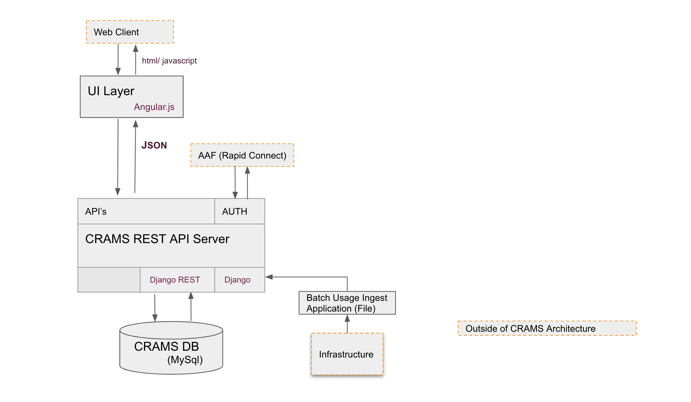
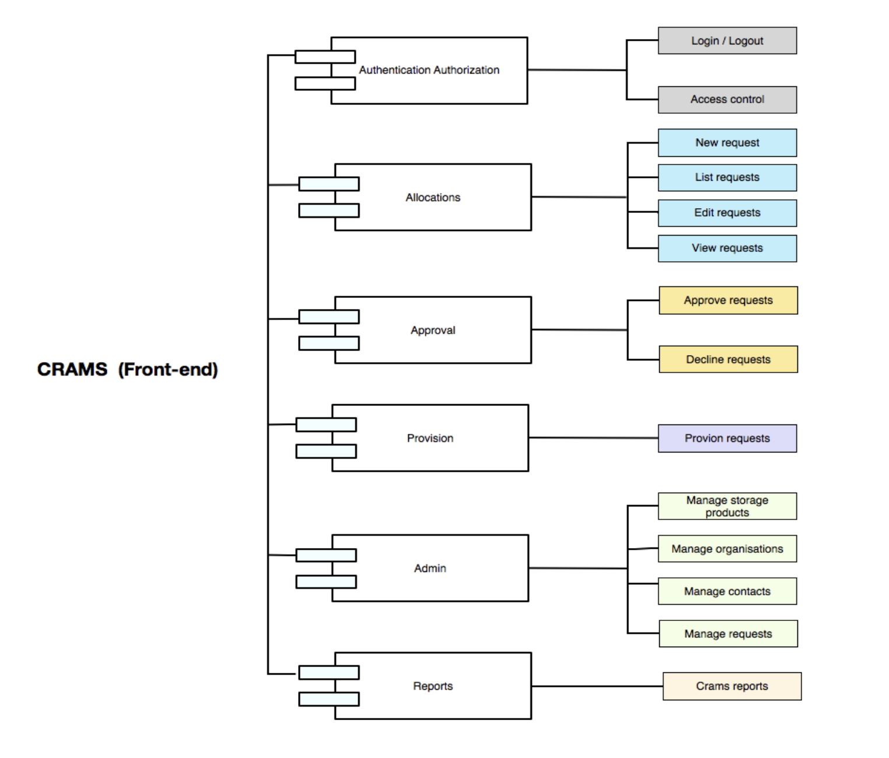
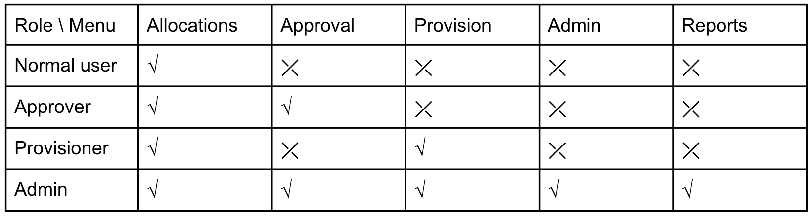

.. _architecture:

============
Architecture
============

This page describes the architecture of CRAMS.

Web Server
  MyTardis is typically deployed with the standard
  `Nginx <http://nginx.org>`_ +
  `Gunicorn <http://gunicorn.org>`_ +
  `Django <http://www.djangoproject.com/>`_ +
  `Python <http://docs.python.org/>`_ stack.

Key Technical Components / CRAMS Services
----------------------------------------

Allocation Request
   requesting new resources, projects 
   view current allocations

Authentication
   Authenticate users: current implementation include Basic authentication and RapidConnect AAF.

Authorisation
  View current roles, add/remove user roles

Data Administration
   Allow management of common data related to products, user etc.

Data Ingest
  Bulk Ingest of information related to resource allocation, usage and one-off data migration

Reporting
  A predefined set of business views for use by top and middle level management. 

Request Approval
   Manage resource request approval and decline process

Resource Provision
  Assist external clients by providing
    -  information on resource requests requiring provisioning,
    - update crams with metadata on provision status

Provisioner
  Interacts primarily with Crams Resource Provisioning service to 
    - request new allocations requiring provision
    - report back to Crams on provisioning status.

Usage Ingester 
  Interacts with Data Ingest Service to update Crams with information related to resource usage. 
    

Front-end
  A mediator that interacts with multiple CRAMS Services to provide users with seamless experience managing resource allocations. 
  All functionalities are grouped visually and logically into thematic units - Allocations, Approval, Provision, Admin and Reports.
  Current implementation include a javascript/HTML web portal ( HTML 5, CSS3 and bootstrap, Angular JS and Node JS) that can be accessed online. 

Security Model
--------------

Security from the perspective of software development is the continuous process of maintaining confidentiality, integrity, and availability of a system, and system data.  

Confidentiality
Crams maintains confidentiality by requiring Authentication and by enforcing authorisation rules on all queries and updates. Exceptions are made for look-up queries that fetch common open source data like FOR codes, etc. Crams authorisation rules are defined per e_research_body thereby eliminating accidental disclosure of data across e_research clients serviced by a single Crams API server.  
Access to crams artefacts can be at User or Admin level. At User level, access to project or relevant resource application data is granted only if the user has access to the project. Crams Admin can access all Projects and associated resource data, in addition to common data related to Contacts, Products etc. However, since authorisation is defined at e_research_body level, an admin can only access common data associated with e_research_body they are authorised for. 

Integrity: CRAMS enforces a status model on Resource Allocation workflow.  

Authentication
^^^^^^^^^^^^^^
CRAMS is using AAF Rapid Connect to authenticate an user to use the web application. User needs to select his own institution’s IDP to login to the system.

Authorisation
^^^^^^^^^^^^^
User could have a different kinds of  roles in CRAMS. Each role has different permission to access to different menu, the following Role-Menu matrix  table shows all permissions. CRAMS will determine the UI navigation menu based on user roles after user logged in.

Source Code
-----------

