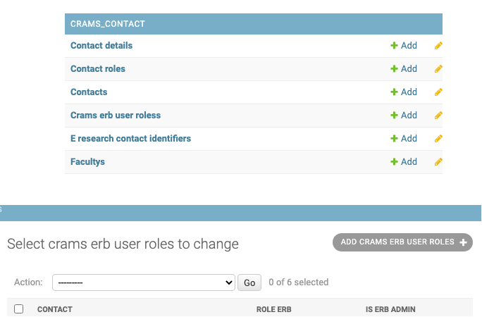
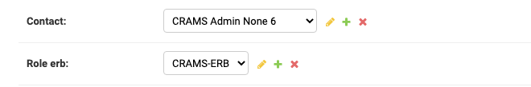
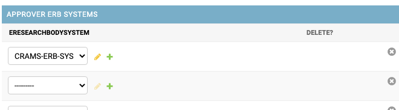
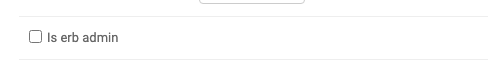
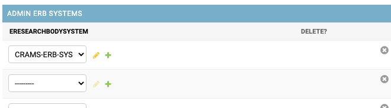

================
Admin User Guide
================

Storage Request Allocation Approvals, Edit and Decline
------------------------------------------------------

Select the “Resource Approver”  from the Select view dropdown located in the left top corner.

< figure - approval view>

“Waiting For Approval” option is selected by default from the Approval menu and will display the Allocation Requests with pending approval.

Status filter can be used to filter by the status of “Submitted” / “Extension Submitted” 

Click on the Project name and review the information provided and the storage quota requested.

< figure>  view request 

Edit a Storage Request
----------------------
Approver can edit a submitted request by clicking on the “Edit” button. This will open the Request submission form where the required amendments can be done and resubmitted.

< figure>  edit  request 

Approve a Storage Request
--------------------------
Approver can amend the storage quota that can be approved by changing the value in the text box “Approved Allocation Change”.

The comment box can be used to provide some comments regarding allocation which could be useful for the provisioner.  The comments are visible for the roles of  Approver, Provisioner and Service Administrator. 

By clicking the “Approve” button the storage allocation request is approved and it can’t be reversed there after.

Decline a Storage Request
-------------------------

An Allocation request can be declined by clicking the “Decline Request”  button if the allocation request does not contain sufficient information or for any other reason.
It’s required to provide a reason if an allocation request to be declined.

Provision of storage allocation request 
---------------------------------------

The provisioning of storage product/s requested through a particular allocation/project is required to be handled at the storage infrastructure level. Each of the storage provisioned at infrastructure needs to be identified using a “Provision Id” recorded at the back end storage infrastructure management system. Once the storage is provisioned at infrastructure level, this provision id needs to be recorded in the CRAMS using the “Provisioning Request” form.

Select the “Resource Provisioner”  from the Select view dropdown located in the left top corner.

< figure - prov view>

“Waiting For Provision” option is selected by default, from the Provision menu and will display the Allocation Requests waiting for provision.

Click on the Project name to review the project details if required. 

Click on the action button “Provision” to open the form “Provision Request” 

Image

Provision a project in full
---------------------------
A project may include multiple storage products and if all of them have provisioned at infrastructure, then all of them can be recorded as provisioned in CRAMS. 

To so, 
Select each of the storage products by clicking the check box at left, enter provision ids for each of them, provide provision notes ( optional) and click the provision button.

Partial Provision
-----------------
There can be situations where not all the approved storage products are able to be provisioned due to storage of a particular storage product or due to some other reason.

Partial provision feature is used to provision some selected storage products only from the approved ones. 

To so, 

Only select the storage product/s that have been provisioned at infrastructure, enter provision ids for each of them, provide provision notes ( optional) and click the provision button.

User Role Management
--------------------

To setup user roles that would give different level of access to requests, approving requests and provisioning requests for users you need to access the django admin. To set up a user account with django admin access check here: :ref:`setup-user`

Role Permissions/Access
~~~~~~~~~~~~~~~~~~~~~~~

- EResearch Body Admin will have access to the ERB level of all ERBS requests.

- EResearch Body System Admin roles will have access to requests within their ERBS level.

- Approver roles will have access to their ERBS level of requests for approving requests.

- Provisioners will have access to the ERB level access of all ERBS requests.

Role Set Up
~~~~~~~~~~~

In order to set the role of a user first log into the django admin

.. image:: ../images/admin_login.png

Click on `Crams erb user roles` under the `CRAMS_CONTACT` section and click on `ADD CRAMS ERB USER ROLES` button in the top right

Select the contact of the user from the dropdown list and set the Role ERB.

Approver Role
~~~~~~~~~~~~~~~~~~~~~~~~~
To set the user as an approver role select the `ERBS` in the `Approver ERB Systems` section.

Provisioner Role
~~~~~~~~~~~~~~~~~~~~~~~~~~~~

To set the user as a provisioner role select the `Provider` in the `Providers` section.

.. image:: ../images/admin_provisioner_role.png

ERB Admin Role
~~~~~~~~~~~~~~~~~~~~~~~~~~

To set the user a ERB Admin role `Check` the tickbox `Is erb admin` at the top.

ERBS Admin Role
~~~~~~~~~~~~~~~~~~~~~~~~~~~

To set the user a ERBS Admin role select the `ERBS` in the `Admin ERB Systems` section.

End Date of Role user Access privilieges
~~~~~~~~~~~~~~~~~~~~~~~~~~~~~~~~~~~~~~~~

To set a date that would cease the users privilieges access, set the date and time in the `End date` section.

